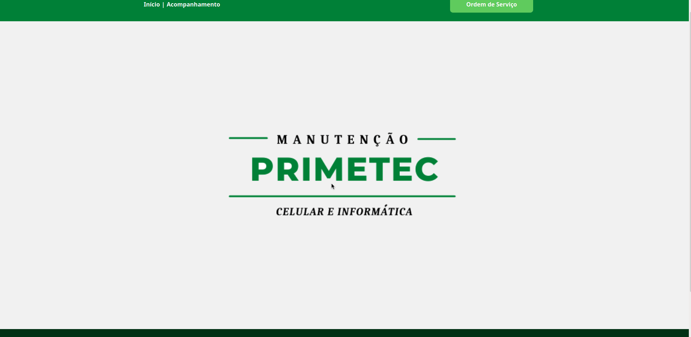
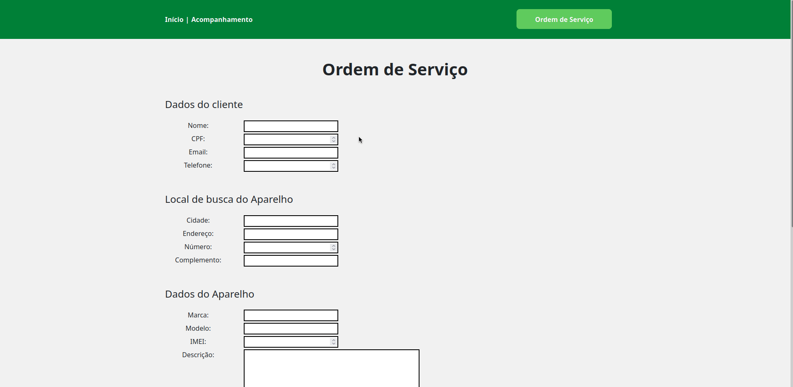
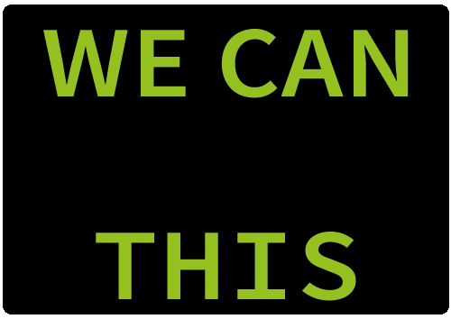

# Primetec
<h1 align="center">

  Apresetantação

  
</h1>
<h1 align="center">

  Funcionalidades

  
</h1>

  <a href="#-tecnologias">Tecnologias</a>&nbsp;&nbsp;&nbsp;|&nbsp;&nbsp;&nbsp;
  <a href="#-Objetivo">Objetivo</a>&nbsp;&nbsp;&nbsp;|&nbsp;&nbsp;&nbsp;
  <a href="#-projeto">Projeto</a>&nbsp;&nbsp;&nbsp;|&nbsp;&nbsp;&nbsp;
  <a href="#-how-to-test">How to test?</a>&nbsp;&nbsp;&nbsp;|&nbsp;&nbsp;&nbsp;

 

  

## 🚀 Tecnologias

Esse projeto foi desenvolvido com as seguintes tecnologias:

- HTML
- CSS
- JavaScript
- VueJS 
- Axios
- Java SpringBoot
- H2 database

## 🔖 Objetivo

Projeto da faculdade simples, tive essa ideia na intenção de ajudar meu irmão na loja de manuntenção dele de aparelhos celulares.

## 💻 Projeto

O projeto consiste em 3 páginas, início, acompanhamento e ordem de serviço, a tela de início é a apresentação, a de acompanhamento, como o nome já diz, pra acompanhar a situação da ordem de serviço e a ultima tela, a de ordem de serviço que é um formulário para o cliente preencher efetuando assim a ordem de serviço.

Ao efetuar a ordem de serviço é enviado um email para o cliente e para o meu irmão com os dados do formulário e o número da ordem de serviço.

##  How to test?

    --Open terminal--

    #Clone repo from github
    git clone https://github.com/Ryandls/project-primetec.git

    #Entry in Primetec folder
    cd project-primetec

    Up the back end java first, after front end.

    #Run project Front-End

    npm install

    npm run serve

<h3><strong>Back-End created by Fransisco | Front-End Bryan</strong><h3>

